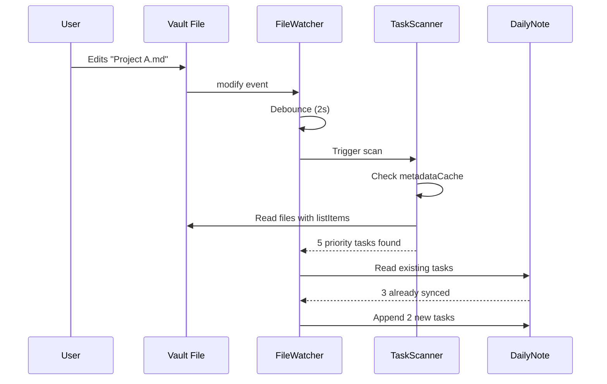

# Task Sync - Standalone Plugin

## Overview

A lightweight, standalone Obsidian plugin that syncs vault-wide high-priority tasks into the daily note as **real markdown checkboxes**.

| Direction | Behavior |
|-----------|----------|
| **Vault → Daily Note** | Scans for high-priority tasks, appends new ones to the target section |
| **Daily Note → Vault** | Checking a task in the Daily Note marks the original task as done in source |

---

## Design Principles

| Principle | Implementation |
|-----------|----------------|
| **Performance First** | Use `app.metadataCache` to skip files without list items |
| **Append Only** | Never delete or rewrite existing content; only append new tasks |
| **Two-Way Toggle** | `ReverseSyncService` syncs both check AND uncheck to source files |
| **Loop Prevention** | File watcher explicitly ignores the daily note |
| **Mode Agnostic** | Uses `vault.on('modify')` to detect checkbox changes in any mode |
| **Native Links** | Use `app.fileManager.generateMarkdownLink()` for vault-aware links |

---

## Plugin Identity

| Field | Value |
|-------|-------|
| **Name** | Task Sync |
| **ID** | `task-sync` |
| **Description** | Syncs high-priority tasks from across your vault into your daily note |
| **Author** | Brad Wales |
| **Minimum Obsidian Version** | 1.0.0 |

---

## Architecture & Project Structure

```
task-sync/
├── main.ts                     # Plugin entry point (~80 lines)
├── manifest.json
├── styles.css                  # Minimal (if needed)
├── src/
│   ├── models/
│   │   └── PriorityTask.ts     # Data structures
│   ├── services/
│   │   ├── TaskScannerService.ts    # Vault scanning (using Cache)
│   │   ├── DailyNoteService.ts      # Appending to Daily Note
│   │   ├── ReverseSyncService.ts    # Handling checkbox clicks in Daily Note
│   │   └── FileWatcherService.ts    # File change detection + debounce
│   ├── settings.ts             # Settings interface + tab
│   └── constants.ts            # Priority markers, defaults
├── package.json
├── tsconfig.json
├── esbuild.config.mjs
└── README.md
```

---

## Data Model

### `src/models/PriorityTask.ts`

```typescript
/**
 * Represents a high-priority task found in the vault.
 */
export interface PriorityTask {
    /** The full raw text of the task line found in the source */
    originalLine: string;

    /**
     * The "clean" text used for deduplication.
     * Stripped of checkboxes (- [ ]), priority markers (🔺/⏫), and wikilinks.
     */
    cleanText: string;

    /** Path to source file (relative to vault root) */
    filePath: string;

    /** Line number in source file (0-indexed) */
    lineNumber: number;

    /** Priority level */
    priority: 'highest' | 'high';
}

/**
 * Represents a task already synced to the daily note.
 */
export interface SyncedTask {
    /** Clean text (for deduplication matching) */
    cleanText: string;

    /** The full line as it currently exists in the Daily Note */
    line: string;

    /** Whether the checkbox is checked */
    completed: boolean;

    /** Line number in daily note */
    lineNumber: number;
}

/**
 * Tracks checkbox state for reverse sync detection.
 */
export interface CheckboxState {
    /** Line number in daily note */
    lineNumber: number;

    /** Whether checkbox is checked */
    checked: boolean;

    /** Clean text for matching to source */
    cleanText: string;

    /** Source file path extracted from wikilink */
    sourcePath: string | null;
}
```

---

## Core Services

### A. `TaskScannerService` (Performance-Optimized)

**Responsibility:** Efficiently find priority tasks across the vault.

**Key Optimization:** Uses `app.metadataCache.getFileCache(file)` before reading file contents.
- If `cachedMetadata.listItems` is empty → skip the file entirely
- Only reads files that actually contain list items

```typescript
export class TaskScannerService {
    constructor(private app: App) {}

    /**
     * Scan entire vault for uncompleted priority tasks.
     * Uses metadataCache to skip files without list items.
     * @returns Array of PriorityTask objects, sorted by priority (highest first)
     */
    async scanVault(): Promise<PriorityTask[]>

    /**
     * Check if file has list items via cache (fast).
     * @returns True if file might contain tasks
     */
    private hasListItems(file: TFile): boolean

    /**
     * Parse a single file for priority tasks.
     * Only called if hasListItems() returns true.
     */
    private async parseFile(file: TFile): Promise<PriorityTask[]>

    /**
     * Extract priority level from task line.
     * @returns 'highest' (⏫), 'high' (🔺), or null
     */
    private extractPriority(line: string): 'highest' | 'high' | null

    /**
     * Clean task text for deduplication.
     * Strips: checkbox, priority emoji, wikilinks, extra whitespace.
     */
    private cleanTaskText(line: string): string

    /**
     * Check if task line is uncompleted.
     */
    private isUncompleted(line: string): boolean
}
```

---

### B. `DailyNoteService` (Append Logic)

**Responsibility:** Reading from and appending to the daily note.

```typescript
export class DailyNoteService {
    constructor(
        private app: App,
        private settings: PluginSettings
    ) {}

    /**
     * Get today's daily note file.
     * @returns TFile or null if not found
     */
    async getTodaysDailyNote(): Promise<TFile | null>

    /**
     * Append new tasks to the target section.
     * Only appends tasks not already present (by cleanText match).
     * 
     * @param dailyNote - The daily note file
     * @param tasks - Tasks to potentially append
     * @returns Number of tasks actually appended
     */
    async appendNewTasks(dailyNote: TFile, tasks: PriorityTask[]): Promise<number>

    /**
     * Read existing synced tasks from the target section.
     * Used for deduplication.
     */
    async readExistingTasks(dailyNote: TFile): Promise<SyncedTask[]>

    /**
     * Find section boundaries in file content.
     * Locates the header and determines where to append.
     * @returns Insert position or null if header not found
     */
    private findSectionInsertPoint(content: string): number | null

    /**
     * Format a task for insertion into daily note.
     * Uses app.fileManager.generateMarkdownLink() for vault-aware links.
     * Format: - [ ] {cleanText} {priorityEmoji} {link}
     * 
     * @param task - The priority task to format
     * @param dailyNote - The daily note (needed for relative link generation)
     */
    private formatTask(task: PriorityTask, dailyNote: TFile): string
}
```

**Link Generation:**
```typescript
// Uses Obsidian's native API - respects vault link settings
const sourceFile = this.app.vault.getAbstractFileByPath(task.filePath);
const link = this.app.fileManager.generateMarkdownLink(
    sourceFile as TFile,
    dailyNote.path
);
// Result respects "Shortest path" vs "Relative path" vault settings
```

**Output Format:**
```markdown
- [ ] Finish quarterly report 🔺 [[Q1 Review]]
```
*(Link format depends on vault settings)*

Components:
- `- [ ]` - Standard checkbox
- `{cleanText}` - Task text (stripped of original checkbox/emoji)
- `{priorityEmoji}` - `🔺` or `⏫` added explicitly
- `[[{sourcePath}]]` - Wikilink to source file

---

### C. `ReverseSyncService` (Two-Way Toggle)

**Responsibility:** Detect checkbox changes in daily note and sync to source files.

**Bidirectional:** Handles both checking AND unchecking tasks. If you accidentally check and then uncheck, the source file reflects the correction.

**Mode-Agnostic:** Uses `vault.on('modify')` which fires regardless of how the checkbox was toggled (Reading Mode, Live Preview, Source Mode, other plugins).

```typescript
export class ReverseSyncService {
    /** Cached checkbox states for comparison */
    private checkboxCache: Map<number, CheckboxState> = new Map();

    constructor(
        private app: App,
        private dailyNoteService: DailyNoteService
    ) {}

    /**
     * Start watching the daily note for checkbox changes.
     * Called when plugin loads or daily note changes.
     */
    async startWatching(dailyNote: TFile): Promise<void>

    /**
     * Stop watching (cleanup on unload).
     */
    stopWatching(): void

    /**
     * Handle daily note modification.
     * Compares new content against cached state to detect toggles.
     */
    async handleDailyNoteModified(file: TFile): Promise<void>

    /**
     * Build checkbox state cache from file content.
     * Called on initial load and after each modification.
     */
    private parseCheckboxStates(content: string): Map<number, CheckboxState>

    /**
     * Find checkboxes that changed state (in either direction).
     * Returns lines where checked state differs between old and new.
     */
    private findChangedCheckboxes(
        oldState: Map<number, CheckboxState>,
        newState: Map<number, CheckboxState>
    ): { state: CheckboxState; nowChecked: boolean }[]

    /**
     * Update the source file to match the daily note checkbox state.
     * Finds matching line by cleanText and sets checkbox accordingly.
     * 
     * @param state - The checkbox state from daily note
     * @param checked - Whether to check or uncheck the source task
     */
    async syncToggleToSource(state: CheckboxState, checked: boolean): Promise<boolean>

    /**
     * Extract source path from wikilink in line.
     * e.g., "[[Work/Reports]]" → "Work/Reports.md"
     */
    private extractSourcePath(line: string): string | null
}
```

**Detection Logic:**
1. Cache checkbox states when daily note is loaded
2. On `vault.on('modify')`, check if modified file is the daily note
3. Parse new checkbox states
4. Compare: find lines where checked state differs (either direction)
5. For each change:
   - Extract `[[source]]` from the line
   - Update source file: `[ ]` → `[x]` or `[x]` → `[ ]`
6. Update cache to new state

**Example:**
```typescript
for (const { state, nowChecked } of changedCheckboxes) {
    await this.syncToggleToSource(state, nowChecked);
}
```

---

### D. `FileWatcherService` (Triggers)

**Responsibility:** Debounce file changes and trigger vault scans.

**Critical Rule:** Ignores the daily note to prevent sync loops.

```typescript
export class FileWatcherService {
    private debounceTimer: NodeJS.Timeout | null = null;
    private eventRef: EventRef | null = null;

    constructor(
        private app: App,
        private settings: PluginSettings,
        private onSync: () => Promise<void>,
        private getDailyNotePath: () => string | null
    ) {}

    /**
     * Start watching vault for file modifications.
     */
    start(): void

    /**
     * Stop watching and clean up.
     */
    stop(): void

    /**
     * Handle file modification event.
     * Ignores daily note. Debounces rapid changes.
     */
    private handleModify(file: TFile): void

    /**
     * Check if file should trigger a sync.
     * Returns false for daily note (loop prevention).
     */
    private shouldTriggerSync(file: TFile): boolean
}
```

---

## Settings

### `src/settings.ts`

```typescript
export interface PluginSettings {
    /** Enable/disable the sync feature */
    enabled: boolean;

    /** Section header to target in daily note */
    sectionHeader: string;

    /** Maximum tasks to sync (0 = unlimited) */
    taskLimit: number;

    /** Debounce delay in milliseconds */
    debounceMs: number;

    /** Include 'highest' priority (⏫) tasks */
    includeHighest: boolean;

    /** Include 'high' priority (🔺) tasks */
    includeHigh: boolean;

    /** Enable two-way sync (daily note → source) */
    enableReverseSync: boolean;
}

export const DEFAULT_SETTINGS: PluginSettings = {
    enabled: true,
    sectionHeader: "## ⚡ High Priority Tasks",
    taskLimit: 5,
    debounceMs: 2000,
    includeHighest: true,
    includeHigh: true,
    enableReverseSync: true,
};
```

### Settings Tab UI

- **Enable sync** - Master toggle
- **Section header** - Text input for target section
- **Task limit** - Number input (0 = no limit)
- **Debounce delay** - Slider (500ms - 5000ms)
- **Priority filters** - Checkboxes for highest/high
- **Enable reverse sync** - Toggle two-way completion

---

## Plugin Entry Point

### `main.ts`

```typescript
export default class PriorityTaskSyncPlugin extends Plugin {
    settings: PluginSettings;

    private taskScanner: TaskScannerService;
    private dailyNoteService: DailyNoteService;
    private reverseSyncService: ReverseSyncService;
    private fileWatcher: FileWatcherService;

    async onload(): Promise<void> {
        await this.loadSettings();

        // Initialize services
        this.taskScanner = new TaskScannerService(this.app);
        this.dailyNoteService = new DailyNoteService(this.app, this.settings);
        this.reverseSyncService = new ReverseSyncService(this.app, this.dailyNoteService);

        // Set up file watcher
        this.fileWatcher = new FileWatcherService(
            this.app,
            this.settings,
            () => this.syncPriorityTasks(),
            () => this.dailyNoteService.getTodaysDailyNotePath()
        );

        if (this.settings.enabled) {
            this.fileWatcher.start();
            this.initializeReverseSync();
        }

        // Settings tab
        this.addSettingTab(new SettingsTab(this.app, this));

        // Manual sync command
        this.addCommand({
            id: 'sync-priority-tasks',
            name: 'Sync priority tasks now',
            callback: () => this.syncPriorityTasks(),
        });
    }

    async onunload(): Promise<void> {
        this.fileWatcher?.stop();
        this.reverseSyncService?.stopWatching();
    }

    /**
     * Main sync operation: Vault → Daily Note
     */
    private async syncPriorityTasks(): Promise<void> {
        if (!this.settings.enabled) return;

        const dailyNote = await this.dailyNoteService.getTodaysDailyNote();
        if (!dailyNote) {
            console.log('[TaskSync] No daily note found for today');
            return;
        }

        // Scan vault (uses cache optimization)
        const allTasks = await this.taskScanner.scanVault();

        // Filter by priority settings
        const filteredTasks = this.filterByPriority(allTasks);

        // Apply task limit
        const limitedTasks = this.settings.taskLimit > 0
            ? filteredTasks.slice(0, this.settings.taskLimit)
            : filteredTasks;

        // Append new tasks (deduplication handled inside)
        const count = await this.dailyNoteService.appendNewTasks(dailyNote, limitedTasks);

        if (count > 0) {
            console.log(`[TaskSync] Synced ${count} new tasks`);
        }
    }

    /**
     * Initialize reverse sync watching.
     */
    private async initializeReverseSync(): Promise<void> {
        if (!this.settings.enableReverseSync) return;

        const dailyNote = await this.dailyNoteService.getTodaysDailyNote();
        if (dailyNote) {
            await this.reverseSyncService.startWatching(dailyNote);
        }
    }

    private filterByPriority(tasks: PriorityTask[]): PriorityTask[] {
        return tasks.filter(t => {
            if (t.priority === 'highest' && this.settings.includeHighest) return true;
            if (t.priority === 'high' && this.settings.includeHigh) return true;
            return false;
        });
    }
}
```

---

## Workflows

### Workflow 1: Vault → Daily Note (Sync)



### Workflow 2: Daily Note → Vault (Reverse Sync)

```mermaid
sequenceDiagram
    participant U as User
    participant DN as DailyNote
    participant RS as ReverseSyncService
    participant V as Source File

    U->>DN: Click checkbox ☑️
    DN->>RS: modify event
    RS->>RS: Compare with cached state
    RS->>RS: Detect [ ] → [x] on line 12
    RS->>RS: Extract [[Work/Reports]]
    RS->>V: Read Work/Reports.md
    RS->>V: Find matching cleanText
    RS->>V: Update [ ] → [x]
    RS->>RS: Update cache
```



---

## Edge Cases

| Scenario | Handling |
|----------|----------|
| **No daily note exists** | Log warning, skip sync |
| **Section header not found** | Log warning, skip sync (no auto-create) |
| **Task already synced** | Skip (dedupe by cleanText match) |
| **Source file renamed** | Obsidian updates wikilink automatically |
| **Task text edited in source** | Treated as new task (old orphaned in daily note) |
| **Multiple tasks same cleanText** | Match first occurrence |
| **Daily note modified** | FileWatcher ignores it (loop prevention) |
| **Rapid file saves** | Debounced to single scan |
| **Undo checkbox toggle (Ctrl+Z)** | ReverseSyncService detects and unchecks source |

---

## Constants

### `src/constants.ts`

```typescript
/** Priority emoji markers (Tasks plugin format) */
export const PRIORITY_MARKERS = {
    highest: '⏫',
    high: '🔺',
} as const;

/** Regex to match priority markers */
export const PRIORITY_REGEX = /[⏫🔺]/g;

/** Regex to match markdown checkbox */
export const CHECKBOX_REGEX = /^(\s*)-\s*\[([ xX])\]/;

/** Regex to match wikilink */
export const WIKILINK_REGEX = /\[\[([^\]]+)\]\]/g;
```

---

## File Summary

| File | Purpose | Est. Lines |
|------|---------|------------|
| `main.ts` | Plugin entry, lifecycle, commands | ~80 |
| `src/models/PriorityTask.ts` | Data interfaces | ~40 |
| `src/services/TaskScannerService.ts` | Vault scanning with cache | ~100 |
| `src/services/DailyNoteService.ts` | Daily note operations | ~120 |
| `src/services/ReverseSyncService.ts` | Two-way completion sync | ~130 |
| `src/services/FileWatcherService.ts` | File watching + debounce | ~60 |
| `src/settings.ts` | Settings interface + tab | ~100 |
| `src/constants.ts` | Markers, regex patterns | ~20 |
| **Total** | | **~650** |

---

## Implementation Order

1. **Scaffold** - Create project structure, manifest, build config
2. **Constants** - Priority markers, regex patterns
3. **Models** - `PriorityTask`, `SyncedTask`, `CheckboxState` interfaces
4. **TaskScannerService** - Vault scanning with metadataCache optimization
5. **DailyNoteService** - Section parsing and append logic
6. **FileWatcherService** - Debounced file watching
7. **main.ts** - Wire up Vault → Daily Note sync
8. **Settings** - Settings interface and tab UI
9. **ReverseSyncService** - Two-way completion (Daily Note → Vault)
10. **Testing** - Manual verification in test vault
11. **Polish** - Error handling, edge cases, logging

---

## Future Considerations

- **Periodic Notes integration:** Auto-detect daily note path from Periodic Notes plugin
- **Custom priority markers:** Support non-Tasks-plugin formats
- **Notification:** Show notice when tasks are synced

---

**Last Updated:** 2026-02-03
